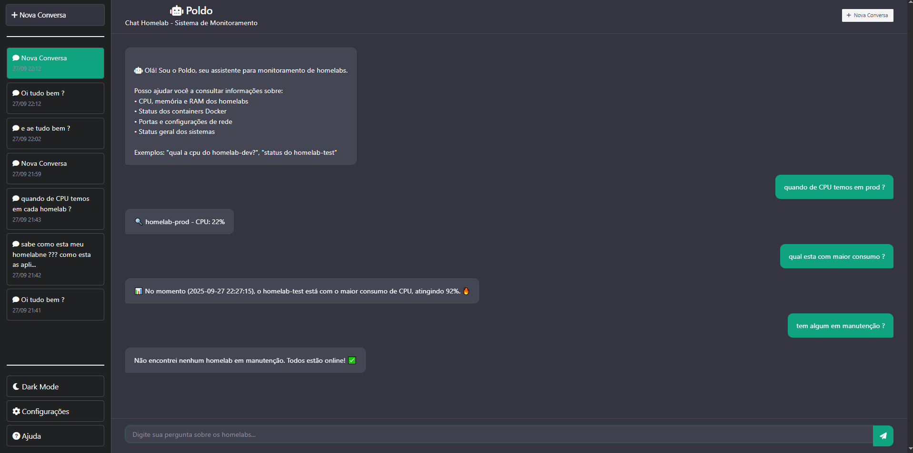

# 🤖 Poldo - Chat Homelab

Um assistente inteligente estilo ChatGPT para monitoramento e consulta de métricas de homelabs, desenvolvido em Django com interface moderna e animações fluidas.




## 🚀 Features Implementadas

### 💬 **Sistema de Chat Inteligente**
- **Chat estilo ChatGPT** com interface moderna e dark mode
- **IA integrada** usando Google Gemini 2.0 Flash
- **Respostas contextuais** baseadas em dados reais dos homelabs
- **Histórico persistente** de conversas salvas no banco de dados

### 🎨 **Interface Moderna & Animações**
- **Dark Mode** com tema minimalista escuro
- **Bulma CSS** para design responsivo e elegante
- **Animações fluidas** com anime.js:
  - ✨ Entrada suave das mensagens (fade in + slide up)
  - 🎯 Hover effects na sidebar (scale 1.02)
  - 💫 Glow animado no foco do input
  - ⚡ Pulse no botão de envio
- **Auto-scroll suave** para acompanhar a conversa

### 🔄 **Envio Sem Reload (AJAX)**
- **Enter envia** mensagem instantaneamente
- **Shift+Enter** quebra linha no input
- **Fetch/AJAX** com proteção CSRF
- **Input limpo** automaticamente após envio
- **Bolhas inseridas** dinamicamente no DOM
- **Sem recarregamento** da página

### 💾 **Persistência de Dados**
- **SQLite3** como banco de dados
- **Models Django** para Conversation e Message
- **Histórico permanente** de todas as conversas
- **Títulos automáticos** baseados na primeira pergunta
- **Navegação entre conversas** via sidebar

### 🏠 **Monitoramento de Homelabs**
- **Dados em tempo real** de CPU, memória, RAM
- **Status dos containers** Docker
- **Portas e configurações** de rede
- **Múltiplos ambientes**: dev, test, prod
- **Histórico de métricas** das últimas 2 horas

### 🎯 **Funcionalidades Avançadas**
- **Sidebar inteligente** com lista de conversas
- **Nova conversa** com um clique
- **Conversa ativa** destacada em verde
- **Timestamps** das conversas
- **Error handling** completo
- **Loading states** durante envio

## 🏗️ **Arquitetura MVC Detalhada**

### **📊 Model (models.py)**
- **Conversation**: Gerencia conversas do chat
- **Message**: Armazena mensagens de usuário e bot
- **HomelabModel**: Acessa dados dos homelabs via JSON
- **ConversationModel**: Lógica de negócio para conversas (legado)

### **🎮 Controller (controller.py)**
- **ChatController**: Classe principal com toda a lógica de negócio
- **Métodos organizados** por responsabilidade:
  - `get_or_create_conversation()` - Gerencia conversas
  - `create_new_conversation()` - Cria novas conversas
  - `get_conversation_context()` - Obtém contexto completo
  - `process_message()` - Processa mensagens e respostas
  - `validate_message_data()` - Valida dados de entrada
  - `handle_send_message_request()` - Manipula requisições AJAX

### **🖥️ View (views.py + templates)**
- **views.py**: Apenas 49 linhas, focado em HTTP requests/responses
- **templates/**: Interface do usuário com animações
- **Separação clara** entre apresentação e lógica de negócio

### **🔄 Fluxo de Dados**
1. **Request** → View recebe requisição HTTP
2. **Delegação** → View delega para Controller
3. **Processamento** → Controller processa lógica de negócio
4. **Model** → Controller acessa dados via Models
5. **Response** → View retorna resposta formatada

### **✅ Benefícios da Arquitetura MVC**
- **Separação de Responsabilidades**: Cada camada tem uma função específica
- **Manutenibilidade**: Código organizado e fácil de modificar
- **Testabilidade**: Lógica de negócio isolada e testável
- **Reutilização**: Controller pode ser usado por diferentes views
- **Escalabilidade**: Fácil adicionar novas funcionalidades
- **Legibilidade**: Código limpo e bem documentado

### **📊 Estatísticas do Código**
- **views.py**: 49 linhas (68% de redução após refatoração)
- **controller.py**: 208 linhas (lógica de negócio centralizada)
- **models.py**: 237 linhas (dados e estrutura)
- **Total**: ~500 linhas de código Python bem organizadas

## 🛠️ **Tecnologias Utilizadas**

### Backend
- **Django 5.2.6** - Framework web
- **SQLite3** - Banco de dados
- **Google Gemini 2.0 Flash** - IA para respostas
- **Python 3.12** - Linguagem principal

### Frontend
- **Bulma CSS** - Framework CSS
- **Font Awesome** - Ícones
- **Anime.js** - Animações
- **Vanilla JavaScript** - Interatividade
- **Fetch API** - Comunicação AJAX

## 📁 **Estrutura do Projeto**

```
poldo-devops-agent/
├── poldo/
│   ├── agent/
│   │   ├── models.py          # Models Django (Conversation, Message)
│   │   ├── views.py           # Views Django (49 linhas, limpo)
│   │   ├── controller.py      # Controller MVC (lógica de negócio)
│   │   ├── urls.py            # Rotas da aplicação
│   │   ├── chat_agent.py      # Lógica da IA (Gemini)
│   │   ├── data/
│   │   │   ├── homelabs.json      # Dados atuais dos homelabs
│   │   │   └── homelabs_history.json  # Histórico de métricas
│   │   └── templates/agent/
│   │       ├── base.html          # Template base com animações
│   │       └── chat.html          # Template do chat
│   ├── poldo/
│   │   ├── settings.py        # Configurações Django
│   │   └── urls.py            # URLs principais
│   └── manage.py              # Script de gerenciamento
├── env/                       # Ambiente virtual Python
├── static/
│   ├── image.png             # Logo do Poldo
│   └── architecture.png      # Diagrama da arquitetura MVC
└── README.md                 # Este arquivo
```

## 🚀 **Como Executar**

### 1. **Ativar Ambiente Virtual**
```bash
cd /home/ubuntu/Projeto/poldo-devops-agent
source env/bin/activate
```

### 2. **Instalar Dependências**
```bash
cd poldo
pip install django google-generativeai
```

### 3. **Configurar Banco de Dados**
```bash
python manage.py makemigrations
python manage.py migrate
```

### 4. **Executar Servidor**
```bash
python manage.py runserver
```

### 5. **Acessar Aplicação**
```
http://localhost:8000/chat/
```

## 🎮 **Como Usar**

### **Consultas Básicas**
- `"qual a cpu do homelab-dev?"`
- `"status do homelab-prod"`
- `"memória do homelab-test"`
- `"containers docker ativos"`

### **Consultas Avançadas**
- `"mostre o histórico de CPU do homelab-dev"`
- `"quais portas estão abertas no homelab-prod?"`
- `"status geral de todos os homelabs"`

### **Navegação**
- **Enter**: Envia mensagem
- **Shift+Enter**: Quebra linha
- **Nova Conversa**: Cria nova conversa
- **Sidebar**: Navega entre conversas

## 📊 **Dados dos Homelabs**

### **Ambientes Disponíveis**
- **homelab-dev**: Ambiente de desenvolvimento
- **homelab-test**: Ambiente de testes  
- **homelab-prod**: Ambiente de produção

### **Métricas Monitoradas**
- **CPU**: Percentual de uso
- **Memória**: Percentual de uso
- **RAM**: Quantidade total
- **Docker**: Número de containers ativos
- **Portas**: Lista de portas abertas
- **Rede**: Endereço IP
- **Status**: online/manutenção

## 🔧 **Configurações**

### **API Key do Gemini**
Configure no arquivo `chat_agent.py`:
```python
self.api_key = "SUA_API_KEY_AQUI"
```

### **Dados dos Homelabs**
Edite os arquivos JSON em `agent/data/`:
- `homelabs.json` - Dados atuais
- `homelabs_history.json` - Histórico

## 🎨 **Customização**

### **Cores e Tema**
Edite o CSS no `base.html`:
```css
/* Cores principais */
--primary-color: #10a37f;
--background-color: #343541;
--sidebar-color: #202123;
```

### **Animações**
Ajuste as animações no JavaScript:
```javascript
// Duração das animações
duration: 350,  // ms
easing: 'easeOutQuad'
```

## 🐛 **Troubleshooting**

### **Erro de CSRF**
- Verifique se o token CSRF está sendo enviado
- Confirme se `` está no template

### **Erro de API**
- Verifique a API key do Gemini
- Confirme conexão com internet

### **Problemas de Banco**
```bash
python manage.py makemigrations
python manage.py migrate
```

## 📈 **Roadmap Futuro**

- [ ] **Autenticação de usuários**
- [ ] **Dashboard de métricas**
- [ ] **Alertas automáticos**
- [ ] **Integração com Prometheus**
- [ ] **API REST completa**
- [ ] **Docker containerization**
- [ ] **Deploy em produção**

## 🤝 **Contribuição**

1. Fork o projeto
2. Crie uma branch para sua feature
3. Commit suas mudanças
4. Push para a branch
5. Abra um Pull Request

## 📄 **Licença**

Este projeto está sob a licença MIT. Veja o arquivo `LICENSE` para mais detalhes.

## 👨‍💻 **Desenvolvedor**

Desenvolvido com ❤️ para monitoramento inteligente de homelabs.

---

**Poldo** - Seu assistente inteligente para homelabs! 🤖✨